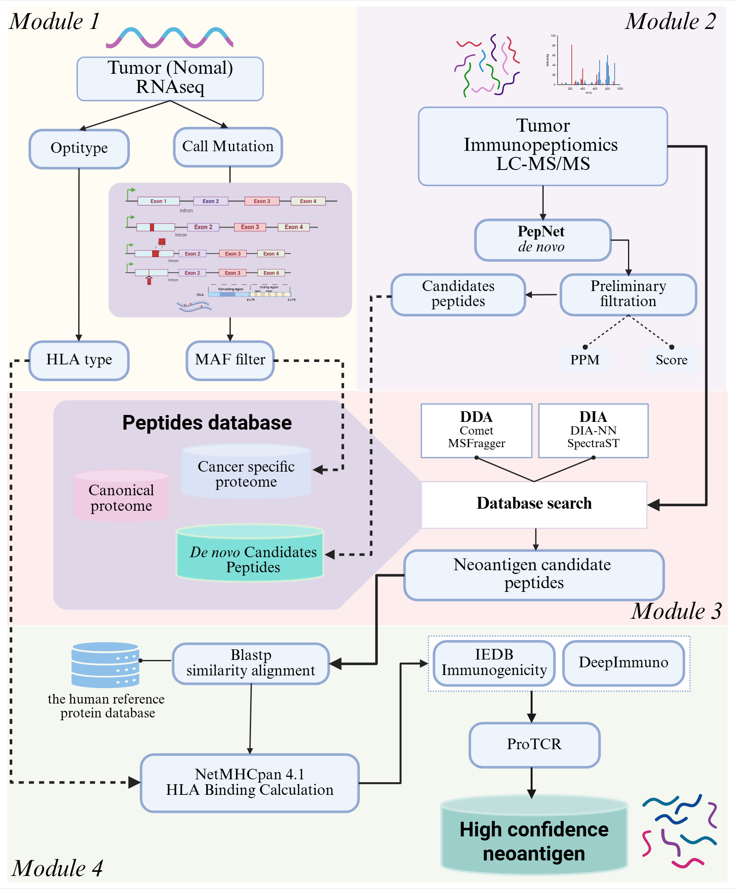

# MSIPep:The process of identifying immunogenic peptides
Immunogenic peptide identification pipeline based on proteogenomic strategies for tumor antigen discovery
## Overnew


# 1.Introduction

Immunopeptidomics directly profiles human leukocyte antigen (HLA)-bound peptides, capturing the dynamic antigen repertoire displayed on tumor cell surfaces. However, existing immunopeptidomics-based methods for immunogenic peptide discovery remain constrained by database-centric identification, dependence on matched normal controls, and the lack of dedicated modules for predicting T-cell recognition, thereby restricting de novo discovery, clinical applicability, and accurate immunogenicity prioritization. We present MSIPep, an integrative immunopeptidomics–transcriptomics pipeline for identifying and prioritizing candidate peptides with high predicted immunogenic potential, including neoantigens. MSIPep combines database-based search with de novo sequencing strategies, supports both data-dependent acquisition (DDA) and data-independent acquisition (DIA) modes, and enhances result robustness through multi-level false discovery rate (FDR) control. To estimate T cell response potential, MSIPep incorporates our in-house deep learning model, ProTCR, which explicitly evaluates peptide/MHC–T cell receptor interactions. Application to acute myeloid leukemia datasets highlighted its improved capability in discovering peptides with high immunogenic potential, while analyses of high-grade serous ovarian carcinoma and triple-negative breast cancer datasets further demonstrated its applicability to solid tumors. MSIPep provides a reusable, integrative analysis framework that enables efficient identification and prioritization of peptides with high immunogenic potential.

# 2. Running environment

MSIPep runs on **Linux** (CentOS 7 / Ubuntu 20.04+). Recommended: **≥16 CPU cores**, **≥64 GB RAM**.

## 2.1 System tools

```bash
which wget unzip conda java python3
```

| Component | Requirement |
|-----------|-------------|
| OS | Linux x86_64 |
| Python | 3.8–3.10 (Conda environments created by `start.sh`) |
| Java | 8+ (GATK, MSFragger) |
| Perl | 5.26+ (some bundled tools) |
| PyYAML | `pip install pyyaml` (required by all `run_*_pipeline.py` scripts) |

## 2.2 Conda environments (`start.sh`)

| Env | Used for | Activated when running |
|-----|----------|----------------------|
| `msipep` | Module 1, 3; Module 4 steps 1–5 | `conda activate msipep` |
| `pepnet` | Module 2 | `conda activate pepnet` |
| `protcr` | Module 4 ProTCR steps (`protcr_run`, `protcr_filter`) | `conda activate protcr` or set `protcr.python` in config |
| `optitype` | HLA typing (run **before** Module 4, not in pep pipeline) | `conda activate optitype` |

## 2.3 Software not installed by `start.sh`

Install separately and set paths in the YAML config:

| Tool | Module | Config key (example) |
|------|--------|----------------------|
| Ensembl VEP + Wildtype/Frameshift plugins | 1 | `tools.vep`, `tools.vep_cache_dir`, `tools.vep_plugins_dir` |
| Singularity/Apptainer + `msconvert.sif` | 2 | `tools.msconvert_sif` |
| NetMHCpan 4.1 (license) | 4 | `tools.netmhcpan` |
| ProTCR (`run_protcr.py`) | 4 | `protcr.install_dir` |
| SpectraST / DIA-NN | 3 (DIA only) | user-provided; not wired in current `database_search.py` |

---

# 3. Installation

## 3.1 Clone repository and run `start.sh`

```bash
git clone https://github.com/liupeng311/MSIPep.git
cd MSIPep
chmod +x start.sh
bash start.sh
```

`start.sh` will:

1. Download Zenodo bundles (MSFragger, PepNet, netMHCpan, reference, etc.) into `software/`, `reference/`, `humandb/`
2. Create Conda environments: `msipep`, `pepnet`, `protcr`, `optitype`
3. Build BWA index for `reference/hg38.fa` if present

## 3.2 Per-sample workflow

1. Create a sample directory, e.g. `/data/SAMPLE01/`
2. Put RNA-seq FASTQ and MS files in your chosen layout
3. Copy example configs and rename:

```bash
cp rnaseq_processing/pipeline_config.example.yaml   /data/SAMPLE01/pipeline_config.yaml
cp denovo/denovo_config.example.yaml                /data/SAMPLE01/denovo_config.yaml
cp database_search/database_search_config.example.yaml /data/SAMPLE01/database_search_config.yaml
cp pep/pep_config.example.yaml                      /data/SAMPLE01/pep_config.yaml
```

4. Edit all paths (`output_dir`, `work_dir`, `reference`, `tools`, inputs) to match your server

## 3.3 Repository layout (orchestration scripts)

All modules are run via **one orchestration script + one YAML config**. Scripts can be invoked from the **repository root** (thin wrappers) or from each module folder:

| Module | Orchestration script | Config template |
|--------|---------------------|-----------------|
| 1 | `run_rnaseq_pipeline.py` | `rnaseq_processing/pipeline_config.example.yaml` |
| 2 | `run_denovo_pipeline.py` | `denovo/denovo_config.example.yaml` |
| 3 | `run_database_search_pipeline.py` | `database_search/database_search_config.example.yaml` |
| 4 | `run_pep_pipeline.py` | `pep/pep_config.example.yaml` |

Root-level `run_*.py` files delegate to the copies inside each module directory; behavior is identical.

---

# 4. Usage

## 4.1 Module 1 — RNA-seq → mutation peptides

**Environment:** `msipep`

```bash
conda activate msipep
python run_rnaseq_pipeline.py --config /data/SAMPLE01/pipeline_config.yaml
```

### Config: `pipeline_config.yaml` (required fields)

| Key | Description |
|-----|-------------|
| `mode` | `tumor_only_pe` \| `tumor_only_se` \| `tumor_normal` |
| `sample_name` | Sample ID (used in output filenames) |
| `output_dir` | All Module 1 outputs |
| `input.fq1` / `fq2` | Tumor FASTQ (`tumor_only_*`; `fq2` optional for `tumor_only_se`) |
| `input.tumor_rna_*` / `normal_rna_*` | Tumor/normal FASTQ (`tumor_normal`) |
| `reference.*` | `genome_fasta`, `star_index`, `gtf` |
| `tools.*` | Trimmomatic, VEP, ANNOVAR paths |
| `peptide.*` | `flanking_length: 24`, `downstream_length: 0`, `noncoding_window: 100`, `noncoding_lengths: "8,9,10,11"` |


**HLA typing:** run OptiType separately (`conda activate optitype`); pass result folder to Module 4 as `input.optitype_dir`.

---

## 4.2 Module 2 — De novo sequencing

**Environment:** `pepnet`

```bash
conda activate pepnet
python run_denovo_pipeline.py --config /data/SAMPLE01/denovo_config.yaml
```

```bash
# Only filter existing PepNet TSV
python run_denovo_pipeline.py --config /data/SAMPLE01/denovo_config.yaml --mode filter_only
```

### Config: `denovo_config.yaml`

| Key | Description |
|-----|-------------|
| `sample_name` | Sample ID |
| `output_dir` | PepNet TSV and filtered FASTA |
| `mode` | `full` or `filter_only` |
| `input.raw_mgf_dir` | Directory of `.raw` or `.mgf` (`full` mode) |
| `input.tsv` | TSV path(s) or glob (`filter_only` mode) |
| `tools.msconvert_sif` | msconvert Singularity image |
| `tools.pepnet_script` / `pepnet_model` | PepNet paths |
| `filter.output_mode` | `merged` → `{sample}_denovo_filtered.fasta`; or `per_file` |

---

## 4.3 Module 3 — Database search

**Environment:** `msipep`

```bash
conda activate msipep
python run_database_search_pipeline.py --config /data/SAMPLE01/database_search_config.yaml
```

```bash
python run_database_search_pipeline.py --config /data/SAMPLE01/database_search_config.yaml --mode postprocess_only
```

### Config: `database_search_config.yaml`

| Key | Description |
|-----|-------------|
| `sample_name` | Sample ID |
| `output_dir` | Search and post-process outputs |
| `mode` | See CLI options above |
| `input.fasta_list` | Protein/peptide FASTAs merged to `combined_protein_db.fasta` |
| `input.raw` | MSFragger `.raw` file(s) |
| `input.mgf` | Comet `.mgf` file |
| `tools.msfragger_dir` / `comet_dir` / `comet_exe` | Search engine paths |

Orchestrator calls `database_search.py`, which runs search, then `msfragger-pep-I.py` / `comet-pep.py`, and merges Class I peptides.

### Main output

- `merged_classI_dedup.fasta` (input to Module 4 as `input.classI_fasta`)

---

## 4.4 Module 4 — Immunopeptide filtering

**Environment:** `msipep` (steps 1–5); `protcr` (steps 6–7, or set `protcr.python`)

```bash
conda activate msipep
python run_pep_pipeline.py --config /data/SAMPLE01/pep_config.yaml

conda activate protcr
python run_pep_pipeline.py --config /data/SAMPLE01/pep_config.yaml --from-step protcr_run
```

Alternatively, set `protcr.python` to the protcr env Python and run the full pipeline in one `msipep` session for steps 1–5, then invoke with `--from-step protcr_run` under `protcr`.

### CLI options

| Option | Default | Choices |
|--------|---------|---------|
| `--config` | (required) | path to YAML/JSON |
| `--from-step` | `blastp` | `blastp`, `netmhcpan`, `iedb`, `deepimmuno`, `protcr_input`, `protcr_run`, `protcr_filter` |
| `--to-step` | `protcr_filter` | same as above |

Toggle steps with `steps.run_blastp`, `steps.run_iedb`, etc. in the config.

---

# 5. Docker
The repository includes a **slim image** (`Dockerfile`): pipeline scripts + Conda envs only. **Reference, software bundles, and sample data are mounted at run time** (not required for `docker build`).
## 5.1 Build image

```bash
cd MSIPep
docker build -t msipep:latest .
```

Prepare host resources **before the first run** (not before build):

```bash
bash start.sh
```

## 5.2 Run with volume mounts
Mount three host directories and point YAML paths to container paths:
Example — Module 1:

```bash
docker run --rm \
  -v /host/data:/data \
  -v /host/reference:/ref \
  -v /host/software:/software \
  msipep:latest rnaseq \
  --config /data/SAMPLE01/pipeline_config.yaml
```
## 5.3 Entrypoint modules
The container `ENTRYPOINT` is `docker/entrypoint.sh`. First argument selects the module; remaining arguments are passed to the orchestration script:

```bash
# Module 4 full (steps 1–5)
docker run --rm -v /host/data:/data -v /host/reference:/ref -v /host/software:/software \
  msipep:latest pep --config /data/SAMPLE01/pep_config.yaml

```
In Docker configs, use paths such as `/ref/hg38/hg38.fa`, `/software/MSFragger-3.8`, `/data/SAMPLE01/...`.

## 5.4 Note on Docker Hub image `liupeng311/neoantigen-pipeline:msipep`
That image documents **legacy** entry points (`rna_mut_pep.py`, `immunopep-filter.py`). For the current YAML-driven pipelines in this repository, build with the included `Dockerfile` as shown above.

